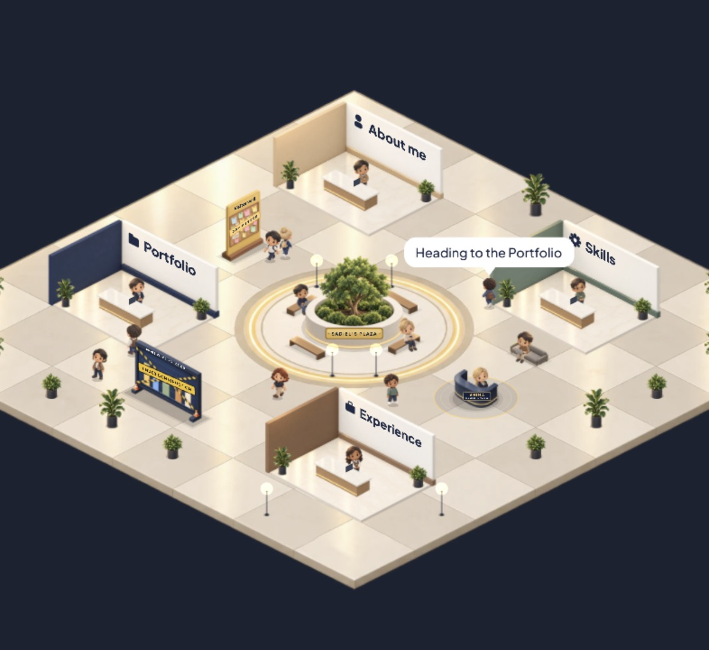
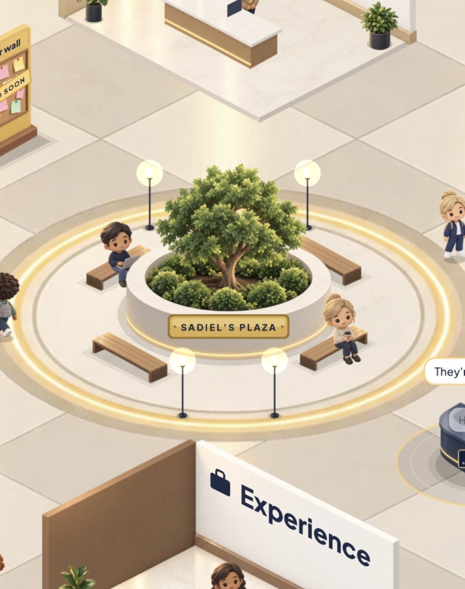
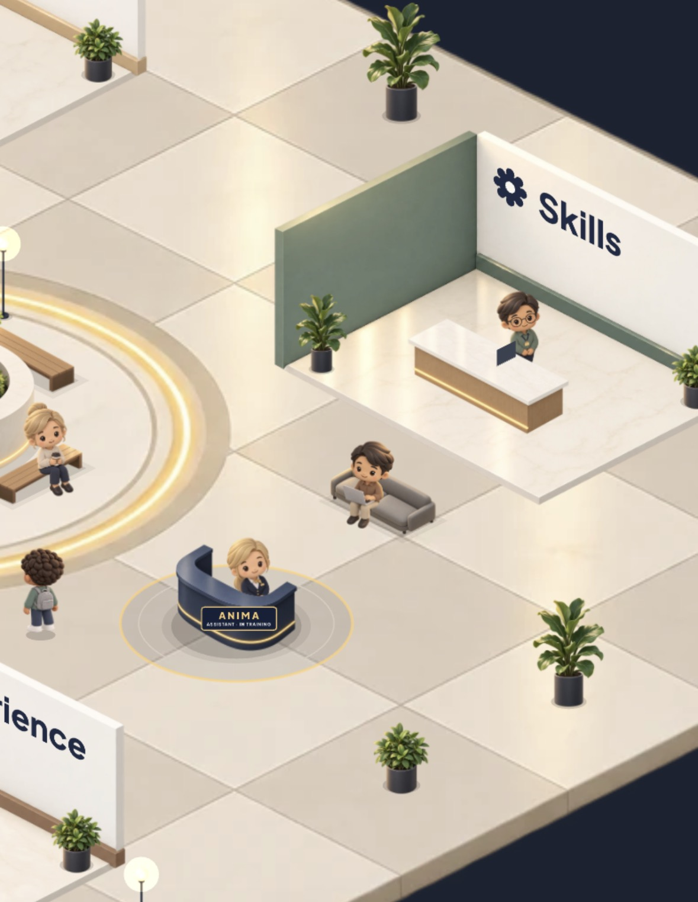
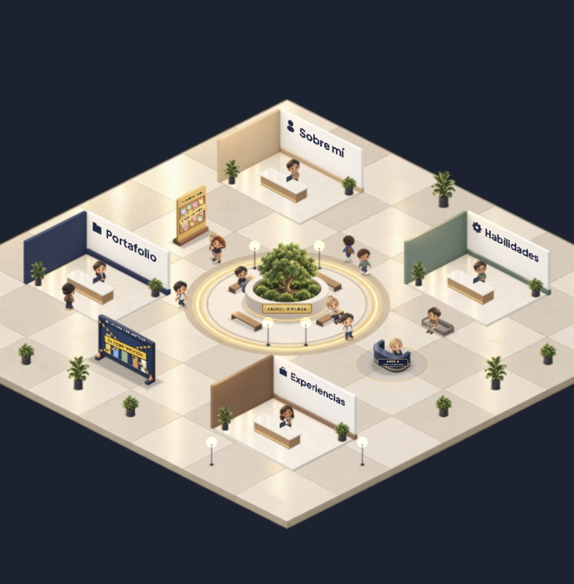

# Portfolio CV · Interactive Lobby

**Sadiel Rojas Padilla — Software Developer (Backend)**

An interactive portfolio designed as a living isometric lobby: visitors walk around on their own, every booth is a section of my CV, and you navigate with nothing but the mouse (or touch).

> 🇪🇸 [Versión en español más abajo](#-español)

## 📸 A look inside



*The whole lobby. Each booth is a section of the CV, and the visitors move around on their own.*

| | |
| :---: | :---: |
|  |  |
| **Sadiel's Plaza** — the center of the lobby: planter, benches and lamps where visitors sit down and chat. | **Skills booth & Anima** — every booth has its own receptionist, and Anima welcomes you at the entrance. |

## ✨ Features

- **Hover** a booth → it lights up, the receptionist greets you and a preview card appears.
- **Click** → the camera zooms smoothly into the booth, the lobby dims and the full section opens.
- **Living scene** → NPC visitors walk a waypoint graph, stop at booths, sit down and chat.
- **Bilingual** → Spanish / English, including the signage inside the lobby. The choice is remembered.
- **Mobile** → drag to pan, pinch to zoom, tap to highlight and tap again to enter.
- **Intro** → on the first load the camera flies down from far away while the clouds part.
- **Recruiter shortcuts** → language, music, simple mode and a one-page Harvard-style CV (PDF, ES / EN) in the top-right corner.
- **Background music** → a lo-fi loop synthesized live with the Web Audio API, with a mute button.
- **Simple mode** → a plain, accessible, linear version of all the content.
- **Accessible** → keyboard navigation, `Esc` to close, and support for `prefers-reduced-motion`.

## 🧱 Tech stack

| Layer | Technology |
| --- | --- |
| Framework | [Next.js 16](https://nextjs.org/) (App Router) + React 19 + TypeScript |
| Scene rendering | [PixiJS 8](https://pixijs.com/) (canvas / WebGL) |
| Animation | [GSAP](https://gsap.com/) |
| Shared state | [Zustand](https://zustand.docs.pmnd.rs/) (React ⇄ Pixi) |
| Styling | CSS Modules |
| Hosting | [Vercel](https://vercel.com/) |

## 🗂️ Architecture

The page is built in three layers:

1. **Scene** — floor, booths, plants, signage (`src/lobby/layers/Scene.ts`, `Stand.ts`, `draw.ts`)
2. **Ambient life** — visitors, receptionists, speech bubbles (`src/lobby/layers/Npc.ts`, `Chibi.ts`, `Bubble.ts`)
3. **Web interaction** — camera, hover/click, section panels (`src/lobby/engine/*`, `src/lobby/store.ts`, `src/components/*`)

PixiJS only draws the lobby. Section content is real React HTML, so it can be read, selected and indexed.

```
src/
├── app/                 # Next.js layout and page
├── components/          # HUD, section panel, simple mode, section content
├── content/sections.ts  # All texts (ES / EN): profile, projects, skills, experience, lobby signage
└── lobby/
    ├── config.ts        # World layout: booth positions, NPC routes, colors
    ├── assets.ts        # Asset manifest (vector placeholders ↔ real images)
    ├── store.ts         # Shared state and language
    ├── engine/          # Pixi app, camera, isometric projection
    └── layers/          # Scene, booths, characters, bubbles
```

## 🚀 Run locally

Requires Node.js 20.9 or newer.

```bash
git clone https://github.com/4n1mah/portfolio-CV.git
cd portfolio-CV
npm install
npm run dev
```

Open http://localhost:3000.

| Script | What it does |
| --- | --- |
| `npm run dev` | Development server |
| `npm run build` | Production build |
| `npm start` | Serves the production build |
| `npm run lint` | ESLint |
| `npm run cv:pdf` | Prints `/cv/es` and `/cv/en` to `public/downloads` with a local Chrome or Edge (run the dev server first) |

## ✏️ Customization

| What | Where |
| --- | --- |
| Texts in both languages | `src/content/sections.ts` |
| CV (one page, Harvard format) | `src/content/cv.ts`, then `npm run cv:pdf` |
| Booth positions, routes, colors | `src/lobby/config.ts` |
| Replace placeholders with real art | `src/lobby/assets.ts` + [`ASSETS.md`](ASSETS.md) |
| Panel and HUD styles | `src/components/*.module.css` |

## 📬 Contact

- Email: [sadielrojas08@gmail.com](mailto:sadielrojas08@gmail.com)
- LinkedIn: [linkedin.com/in/sadielrojaspadilla](https://www.linkedin.com/in/sadielrojaspadilla)
- GitHub: [@4n1mah](https://github.com/4n1mah)

## 📄 License

The code is released under the [MIT License](LICENSE). The personal content (biography, experience, projects) belongs to its author; if you fork this repository, replace it with your own.

---

## 🇪🇸 Español

Portafolio interactivo diseñado como un lobby isométrico vivo: los visitantes caminan solos, cada stand es una sección de mi CV y la navegación se hace solo con el mouse (o el dedo).



*La cartelería del lobby también cambia de idioma: el mismo espacio, en español.*

**Funcionalidades:** animación de entrada entre nubes, hover con glow y saludo de la recepcionista, zoom de cámara al hacer click, NPCs que recorren la plaza, música de fondo con botón de silencio, CV estilo Harvard descargable en PDF, versión en español e inglés, soporte táctil, modo simple accesible y respeto por `prefers-reduced-motion`.

**Ejecutar en local:**

```bash
npm install
npm run dev
```

**Editar contenido:** todos los textos (en ambos idiomas) están en `src/content/sections.ts`. El CV está en `src/content/cv.ts`; después de editarlo, con el servidor corriendo, `npm run cv:pdf` regenera los PDF. La distribución del lobby está en `src/lobby/config.ts`, y la guía para reemplazar los placeholders por arte real está en [`ASSETS.md`](ASSETS.md).

**Licencia:** el código es MIT; el contenido personal pertenece a su autor.
